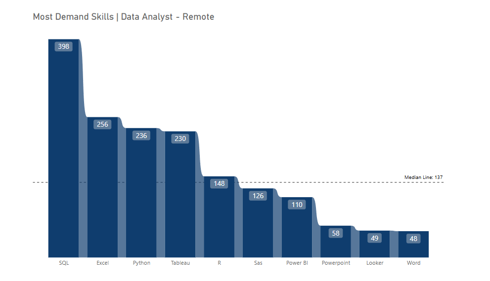
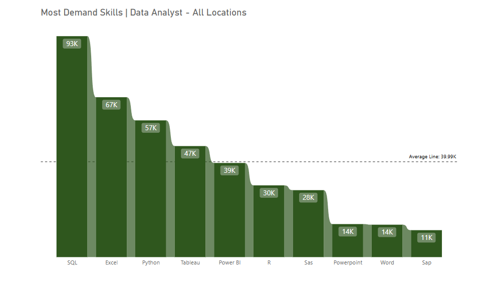
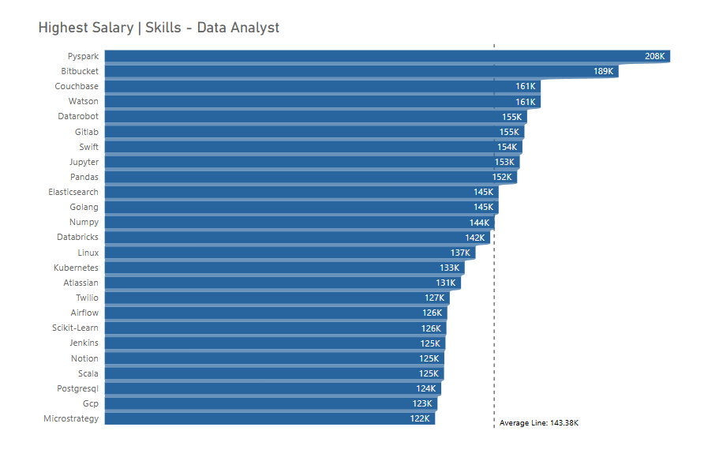
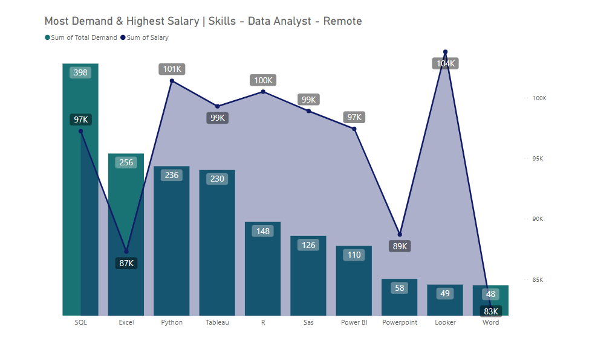

#  📊 Jobs Analysis

This repository contains my exploratory data analysis on job market trends, skills in demand, and salary insights based on multiple data sources. The project uses **SQL for analysis** and **Power BI** for data visualization.

---

## 📁 Folder Structure
- **.csv File:** Contains CSV results of SQL queries
- **Images:** Contains screenshots of SQL results and visualizations
- **Jobs-Report:** Contains SQL code used for querying and analysis

---

## 📌 Introduction

Dive into the data jobs market! Focusing on data analyst roles, this project explores top-paying jobs, in-demand skills, and where high demand meets high salary in data analytics.

---

## 📚 Background

Driven by a quest to navigate the data analyst job market more efficiently, this project was born from a desire to pinpoint top-paying and in-demand skills—streamlining the job search process for others seeking optimal opportunities.

### The questions I aimed to answer through my SQL queries were:
1. Which companies offer the highest salaries for data analyst roles?
2. What skills are most commonly required by those companies?
3. What skills are in highest demand for data analyst positions overall?
4. Which skills are associated with the highest salaries?
5. What are the most optimal skills to learn for aspiring data analysts?

## 🛠 Tools I Used

| Tool        | Purpose                            |
|-------------|------------------------------------|
| SQL         | Data extraction, querying, and analysis |
| Power BI    | Data visualization and dashboards  |

---

## 📊 The Analysis
Each SQL query in this project was designed to explore specific aspects of the data analyst job market. The goal was to uncover insights that can help job seekers better understand which companies offer the best opportunities, which skills are most in demand, and which ones are associated with higher salaries—especially for remote roles.

Here's how I approached each question:

### **1. Top 10 Companies**
To identify the top companies offering the highest-paying remote data analyst positions, I filtered job postings by average yearly salary and selected only those marked as remote (`job_work_from_home = True`). The resulting query highlights the top 10 companies with the most competitive salaries for data analyst roles.

```sql
SELECT 
    d.name,
    f.job_schedule_type,
    f.job_posted_date::DATE,
    f.salary_year_avg AS totals
FROM 
    job_postings_fact AS f
INNER JOIN 
    company_dim AS d
USING (company_id)
WHERE 
    job_title_short = 'Data Analyst'
    AND salary_year_avg IS NOT NULL
    AND job_work_from_home = TRUE
ORDER BY 
    totals DESC
LIMIT 10;
```
---

### **2. Skills Required by Top Companies**

To identify the most commonly required skills by companies offering high-paying remote data analyst roles, I applied the same filtering method as in the previous query—focusing on remote jobs with available salary data. This time, I expanded the query by joining additional tables to extract and aggregate the specific skills associated with those job postings.  

By joining the job postings with the corresponding skill data, the query reveals the top 10 most frequently requested skills among companies that offer competitive salaries for data analyst positions. This insight can help job seekers prioritize which skills to learn or improve based on actual market demand.

```sql
WITH skills_demand AS (
    SELECT 
        f.job_id,
        d.name,
        f.job_schedule_type,
        f.job_posted_date::DATE,
        f.salary_year_avg AS totals
    FROM 
        job_postings_fact AS f
    INNER JOIN 
        company_dim AS d
    USING (company_id)
    WHERE 
        job_title_short = 'Data Analyst'
        AND salary_year_avg IS NOT NULL
        AND job_work_from_home = TRUE
)
SELECT
    d2.skills,
    COUNT(f.job_id) AS total
FROM 
    skills_demand AS f
INNER JOIN 
    skills_job_dim AS d
USING (job_id)
INNER JOIN 
    skills_dim AS d2 
    ON d.skill_id = d2.skill_id
GROUP BY
    d2.skills
ORDER BY 
    total DESC
LIMIT 10;
```
---

### **3. Most In-Demand Skills Across All Locations**

To determine which skills are most in demand for data analyst roles across all job locations—not just remote—I broadened the scope of the filtering criteria. In this query, I selected all data analyst job postings regardless of location, allowing for a more comprehensive view of the skills that employers are consistently looking for in the market as a whole.

By joining job posting data with associated skill data, the query identifies the top 10 most frequently mentioned skills in job listings. The result highlights that **SQL, Excel, Python, Tableau, and Power BI** are among the most sought-after skills for data analysts across the industry.  

This insight is especially valuable for professionals who want to remain competitive in the broader job market, regardless of whether they prefer on-site, hybrid, or remote work settings.

```sql
WITH skills_demand AS (
    SELECT 
        f.job_id,
        d.name,
        f.job_schedule_type,
        f.job_posted_date::DATE,
        f.salary_year_avg AS totals
    FROM 
        job_postings_fact AS f
    INNER JOIN 
        company_dim AS d
    USING (company_id)
    WHERE 
        job_title_short = 'Data Analyst'
)
SELECT
    d2.skills,
    COUNT(f.job_id) AS total
FROM 
    skills_demand AS f
JOIN 
    skills_job_dim AS d
USING (job_id)
INNER JOIN 
    skills_dim AS d2 
    ON d.skill_id = d2.skill_id
GROUP BY
    d2.skills
ORDER BY 
    total DESC
LIMIT 10;
```

---

### **4. Top-Paying Skills for Remote Data Analyst Roles**

In this analysis, I focused on identifying the **top 25 highest-paying skills** associated with remote data analyst positions. By filtering the job postings dataset to include only roles titled *Data Analyst* that are fully remote (`job_work_from_home = TRUE`) and have a specified average annual salary, I was able to calculate the average salary linked to each individual skill.

The query joins job data with skill data to determine which skills are most valuable in terms of compensation. The results represent the top 25 skills that yield the highest average salaries, providing clear guidance for professionals aiming to maximize their earning potential in remote data analyst roles.

```sql
SELECT
    d2.skills,
    ROUND(
        AVG(f.salary_year_avg)::NUMERIC, 0
    ) AS salary_average
FROM
    job_postings_fact AS f
INNER JOIN 
    skills_job_dim AS d
USING (job_id)
INNER JOIN
    skills_dim AS d2 ON d.skill_id = d2.skill_id
WHERE
    job_title_short = 'Data Analyst'
    AND salary_year_avg IS NOT NULL
    AND job_work_from_home = TRUE
GROUP BY 
    d2.skills
ORDER BY
    salary_average DESC
LIMIT 25;
```
---

### **5. High-Demand and High-Paying Skills for Remote Data Analyst Roles**

This analysis aims to identify skills that are both **highly demanded** and **well-compensated** within remote data analyst job postings. By combining data on skill demand and average salary, we can pinpoint the most valuable skills for professionals seeking to optimize their career in the data analytics field—especially in remote work settings.

To do this, I applied filters for:
- Job title: *Data Analyst*
- Remote positions only (`job_work_from_home = TRUE`)
- Postings with available average annual salary data

The query is structured in two parts:
1. **`skills_demand`**: Calculates how frequently each skill appears in remote data analyst postings, giving us a measure of demand.
2. **`salary_average`**: Computes the average salary associated with each skill from those same filtered postings.

These two subqueries are then joined to provide a combined view, showing the top 10 skills that strike the best balance between **market demand** and **earning potential**.

```sql
WITH skills_demand AS (
    SELECT
        d2.skill_id,
        d2.skills,
        COUNT(f.job_id) AS total
    FROM
        job_postings_fact AS f
    INNER JOIN 
        skills_job_dim AS d
    USING (job_id) 
    INNER JOIN 
        skills_dim AS d2 ON d.skill_id = d2.skill_id
    WHERE 
        job_title_short = 'Data Analyst'
        AND job_work_from_home = TRUE
        AND salary_year_avg IS NOT NULL
    GROUP BY 
        d2.skill_id, d2.skills
),
salary_average AS (
    SELECT
        d2.skill_id,
        d2.skills,
        ROUND(
            AVG(f.salary_year_avg)::NUMERIC, 0
        ) AS salary_average
    FROM
        job_postings_fact AS f
    INNER JOIN 
        skills_job_dim AS d
    USING (job_id)
    INNER JOIN
        skills_dim AS d2 ON d.skill_id = d2.skill_id
    WHERE
        job_title_short = 'Data Analyst'
        AND job_work_from_home = TRUE
        AND salary_year_avg IS NOT NULL
    GROUP BY 
        d2.skill_id, d2.skills
)
SELECT
    f.skills,
    SUM(f.total) AS demand,
    ROUND(
        AVG(d.salary_average)::NUMERIC, 0
    ) AS salary 
FROM 
    skills_demand AS f
INNER JOIN 
    salary_average AS d
USING (skill_id)
GROUP BY 
    f.skills
ORDER BY
    demand DESC
LIMIT 10;
```
---

## 🔍 What I Learned
The following section presents the results of my analysis along with key insights derived from the five core questions explored throughout this project. Each question was carefully examined using targeted SQL queries to uncover trends in salary, skill demand, and employer preferences within the data analyst job market—particularly for remote roles. By breaking down these findings, I aim to provide a clearer understanding of what companies are offering the most competitive salaries, which technical skills are most sought after, and how these skills align with higher earning potential. These insights can serve as a valuable reference for job seekers looking to strategically position themselves in a competitive and evolving industry.

---

### 🏢 1. **Top Paying Companies | Data Analayst - Remote** 

From this analysis, we can observe that the highest-paying companies for remote data analyst roles are major tech giants such as Netflix, Meta, Google, and Apple. These companies typically operate at the forefront of innovation in areas like **artificial intelligence, cloud computing, and data-driven engineering**. The strong emphasis on technology and data infrastructure likely drives their demand for skilled analysts and justifies the high salary range of **$140k to over $200k**.  

By examining this trend, we can understand that aligning our skill sets with the **technological needs and analytical maturity** of such companies—particularly in tools and domains relevant to big data, business intelligence, and automation—may increase our chances of securing high-paying opportunities. Additionally, it highlights the value placed on data talent in environments where decision-making is deeply rooted in insights and performance metrics.


---

### 📊 **2. Most Demand Skills | Data Analyst - Remote**
 
From this chart, we can clearly observe that **SQL** stands out as the most demanded tool by a wide margin, followed by **Excel**, **Python**, and **Tableau**—all of which are core to data wrangling, analysis, and visualization. These tools form the backbone of everyday tasks for most data analysts, especially in remote settings where self-sufficiency and versatile skills are crucial.

Interestingly, tools like **R**, **SAS**, and **Power BI** sit just around or below the median line, indicating that while they are still relevant, they are more specialized and potentially company-specific. On the lower end, tools like **PowerPoint**, **Looker**, and **Word** appear less frequently, suggesting they are more supplementary rather than central to the analyst role.

These findings align well with previous insights where we noted that companies highly value technical skills and business alignment. From here, we understand that focusing on core tools like **SQL, Excel, Python, and Tableau** provides a strong foundation to meet most employer demands in the current job market for remote data analysts.




---

### 📊 **3. Most Demand Skills | Data Analyst - All Locations**

This chart reinforces the dominant position of **SQL**, with a significant lead at **93K** mentions—making it the most critical skill across locations. **Excel**, **Python**, and **Tableau** also maintain strong demand, further highlighting their consistent value in data analyst roles regardless of geography.

What’s interesting here is that **Power BI**, while slightly below the average line, still ranks ahead of more statistically inclined tools like **R** and **SAS**, suggesting a higher emphasis on dashboarding and business intelligence tools in the broader market. Meanwhile, **PowerPoint**, **Word**, and **SAP** sit at the bottom, reflecting their role as supporting or domain-specific tools rather than core data analysis instruments.

Overall, this chart tells us that the global demand closely mirrors the remote job market, reaffirming the universal importance of a solid stack—**SQL, Excel, Python, Tableau**—for anyone looking to break into or grow within data analytics.




---

### 💸 4. **Skills That Pay the Most | Data Analyst - In General** 

The Top salary chart shows that advanced and specialized tools or platforms command significantly higher salaries. Pyspark leads the chart at 208K, which aligns with its growing demand in big data processing. Similarly, Bitbucket and Watson—often associated with DevOps and AI—are also highly valued.

What’s notable is the presence of many tools typically associated with data engineering, machine learning, or AI development (e.g., Pyspark, Golang, Databricks, Airflow, Scikit-Learn, Jupyter, Pandas, and Kubernetes). This signals that data analyst roles demanding these higher-end, hybrid skill sets (bordering data science or MLOps) tend to be compensated more generously.

While foundational tools like Pandas and Numpy also appear here, their salary range is closer to the average line—showing that depth in these tools might increase salary but not as drastically as mastering higher-complexity platforms.




---

### 💼 5. **High Pay + High Demand Skills | Data Analayst - Remote**
In the world of remote data analyst roles, **SQL reigns supreme** as the most in-demand skill by a wide margin—appearing in nearly 400 job postings. It's the essential foundation that almost every company expects, and with a respectable average salary of **$97K**, it's both practical and rewarding. Surprisingly, **Excel** comes in second in demand, but its salary drops to **$87K**, hinting that it's often associated with entry-level or less technical roles. Meanwhile, **Python**, a powerful coding language, offers a much better salary at **$101K** despite slightly lower demand. It’s clear: if you're looking for income and job security, mastering **SQL and Python** is a smart move.

On the other end of the spectrum, **Looker** might not show up in many job posts (only 49), but it offers the **highest salary at $104K**. It's a specialized tool, likely used in companies that heavily rely on the Google Cloud stack. Similarly, tools like **R**, **Tableau**, and **SAS** offer strong salary potential (ranging from **$97K to $100K**) with moderate demand—ideal for analysts looking to climb higher in niche or data science-heavy environments.

In contrast, tools like **Word** and **PowerPoint** appear at the bottom both in demand and salary. They’re good to have, but not game-changers. The sweet spot for aspiring analysts lies in combining **high-demand tools** like SQL and Python with **higher-paying niche skills** like Looker or SAS. That blend makes you not only employable—but highly valuable.





---


### 🚀 Summary: What Should You Do?

In the realm of data analysis, **PySpark leads as the top-paying skill**, offering an impressive **$208K**, followed by **Bitbucket** and **Couchbase**, making it clear that cloud-based and engineering-heavy tools command the highest salaries. However, in remote roles, the most *in-demand* skills shift toward practicality—**SQL and Excel** dominate job listings, while **Python**, **Tableau**, and **R** strike a strong balance between salary and demand. Tools like **Looker**, **SAS** and **Power BI**, although less common, offer premium salaries, revealing that niche expertise can be a secret weapon for income growth. Meanwhile, general tools like **PowerPoint** and **Word** are the least valuable in terms of salary and demand. Master core tools like **SQL, Excel and Python** for wide job access, then layer in high-paying niche tools like **Looker or PySpark** to boost your market value.

---

## ✅ Conclusion

This project set out to better understand the current landscape of data analyst jobs by focusing on two key factors: which skills are in highest demand and which offer the best salary potential. With so many options available, job seekers often struggle to know which skills to focus on. By analyzing real job market data, this project provides clear insights into what companies are looking for and what they are willing to pay top dollar for.

Through a series of SQL-driven explorations, I answered five core questions about top-paying companies, the most commonly required and high-paying skills, and the overlap between demand and compensation. The goal was to simplify the job search process for aspiring data analysts by identifying the most strategic and valuable skills to learn—helping them target opportunities that are both in high demand and financially rewarding.


Thank you for checking out this analysis! 
