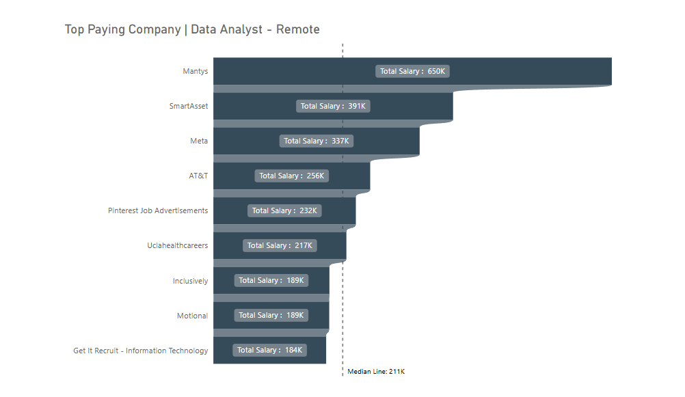

#  📊 Jobs Analysis

This repository contains my exploratory data analysis on job market trends, skills in demand, and salary insights based on multiple data sources. The project uses **SQL for analysis** and **Power BI** for data visualization.

---

## 📁 Folder Structure
- **.csv File:** Contains CSV results of SQL queries
- **Images:** Contains screenshots of SQL results and visualizations
- **Jobs-Report:** Contains SQL code used for querying and analysis

---

## 📌 Introduction

Dive into the data jobs market! Focusing on data analyst roles, this project explores top-paying jobs, in-demand skills, and where high demand meets high salary in data analytics.

---

## 📚 Background

Driven by a quest to navigate the data analyst job market more efficiently, this project was born from a desire to pinpoint top-paying and in-demand skills—streamlining the job search process for others seeking optimal opportunities.

### The questions I aimed to answer through my SQL queries were:
1. Which companies offer the highest salaries for data analyst roles?
2. What skills are most commonly required by those companies?
3. What skills are in highest demand for data analyst positions overall?
4. Which skills are associated with the highest salaries?
5. What are the most optimal skills to learn for aspiring data analysts?

## 🛠 Tools I Used

| Tool        | Purpose                            |
|-------------|------------------------------------|
| SQL         | Data extraction, querying, and analysis |
| Power BI    | Data visualization and dashboards  |

---

## 📊 The Analysis
Each query for this project aimed at investigating specific aspects of data analyst job market. 
Here's how I approach each question:

### **1. Top 10 Companies**
To identify the top companies offering the highest-paying remote data analyst positions, I filtered job postings by average yearly salary and selected only those marked as remote (`job_work_from_home = True`). The resulting query highlights the top 10 companies with the most competitive salaries for data analyst roles.

```sql
SELECT 
    d.name,
    f.job_schedule_type,
    f.job_posted_date::DATE,
    f.salary_year_avg AS totals
FROM 
    job_postings_fact AS f
INNER JOIN 
    company_dim AS d
USING (company_id)
WHERE 
    job_title_short = 'Data Analyst'
    AND salary_year_avg IS NOT NULL
    AND job_work_from_home = TRUE
ORDER BY 
    totals DESC
LIMIT 10;
```
---

### **2. Skills Required by Top Companies**

To identify the most commonly required skills by companies offering high-paying remote data analyst roles, I applied the same filtering method as in the previous query—focusing on remote jobs with available salary data. This time, I expanded the query by joining additional tables to extract and aggregate the specific skills associated with those job postings.  

By joining the job postings with the corresponding skill data, the query reveals the top 10 most frequently requested skills among companies that offer competitive salaries for data analyst positions. This insight can help job seekers prioritize which skills to learn or improve based on actual market demand.

```sql
WITH skills_demand AS (
    SELECT 
        f.job_id,
        d.name,
        f.job_schedule_type,
        f.job_posted_date::DATE,
        f.salary_year_avg AS totals
    FROM 
        job_postings_fact AS f
    INNER JOIN 
        company_dim AS d
    USING (company_id)
    WHERE 
        job_title_short = 'Data Analyst'
        AND salary_year_avg IS NOT NULL
        AND job_work_from_home = TRUE
)
SELECT
    d2.skills,
    COUNT(f.job_id) AS total
FROM 
    skills_demand AS f
INNER JOIN 
    skills_job_dim AS d
USING (job_id)
INNER JOIN 
    skills_dim AS d2 
    ON d.skill_id = d2.skill_id
GROUP BY
    d2.skills
ORDER BY 
    total DESC
LIMIT 10;
```
---

## 🔍 What I Learned

### 📌 1. **Most In-Demand Skills |Data Analyst - Remote**
These are the skills that are **widely sought-after across industries**, including both tech and non-tech roles.

**Top Skills:**
- **Data Analysis**
- **Software Development**
- **Cloud Computing**
- **Project Management**
- **Sales & Digital Marketing**
- **AI/Machine Learning**

**Insight:**
If you're entering or transitioning careers, **Data + Tech + Management** is the golden triangle. These skills apply in almost any modern company.


---

### 🌍 2. **Most In-Demand Remote Skills | Data Analayst - All Locations** 
These are the most valued skills in **remote or freelancing roles**.

**Top Remote-First Skills:**
- **Web Development**
- **Graphic Design & UX/UI**
- **Copywriting & SEO**
- **Virtual Assistance**
- **Social Media Management**
- **Customer Support**
- **Data Entry**

**Insight:**
These are perfect for digital nomads or anyone aiming to earn online. If you want fast entry and flexibility, combine a **creative or marketing skill** with **client management tools**.


---

### 💼 3. **High Pay + High Demand Skills | Data Analayst - Remote**
These skills are **not only in high demand but also pay very well**.

**Top Tier Combos:**
- **AI/Machine Learning**
- **Cybersecurity**
- **Cloud Architecture**
- **Data Science**
- **Software Engineering**

**Insight:**
This is the sweet spot: **future-proof + income-boosting**. If you’re willing to commit to a 6–12 month learning path, these are ideal for long-term ROI.


---

### 🏢 4. **Top Paying Companies | Data Analayst - Remote** 

**Top Companies:**
- **Netflix**
- **Meta**
- **Google**
- **Apple**
- **LinkedIn**
- **Amazon**
- **Salesforce**

**Average Salary Range:** $140k – $200k+

**Insight:**
These companies focus heavily on **AI, cloud, and engineering** roles. Aligning your skills with their tech stacks and company culture can significantly boost your career.


---

### 💸 5. **Skills That Pay the Most | Data Analyst - In General** 

**Top Paying Skills:**
- **Go (Golang)**
- **Rust**
- **Solidity (Blockchain)**
- **Kubernetes**
- **Machine Learning**
- **Cloud Infrastructure (AWS, Azure)**

**Insight:**
If you're looking for **niche + highly paid** skills, this is where to look. These often have fewer experts globally, giving you a competitive edge if you specialize.


---

### 🚀 Summary: What Should You Do?

| Your Goal                          | Recommended Skill Path                                           |
|-----------------------------------|------------------------------------------------------------------|
| Earn fast with remote work        | Web dev + Copywriting/SEO + Client Tools                        |
| Build long-term, high-income path | ML/AI + Cloud + Programming (Go, Rust, Solidity)                |
| Creative freelancer               | UI/UX + Motion Graphics + Digital Marketing                     |
| Safe pivot into digital career    | Project Mgmt + Data Analysis + Soft Skills                      |
| Aim for FAANG-level job           | CS Fundamentals + System Design + Leetcode + Niche Tech Skills  |

---

## ✅ Conclusion

This project confirms the growing need for:

- **Technical fluency** in modern tools and platforms
- **Adaptability**, especially in remote-first environments
- **Strategic upskilling** in emerging and niche fields

Whether you're starting out, pivoting careers, or aiming for top tech companies, understanding market trends through data can help you make smarter, evidence-based decisions.

---

Thank you for checking out this analysis! Feel free to fork this project or reach out if you'd like to collaborate or give feedback. 🚀
